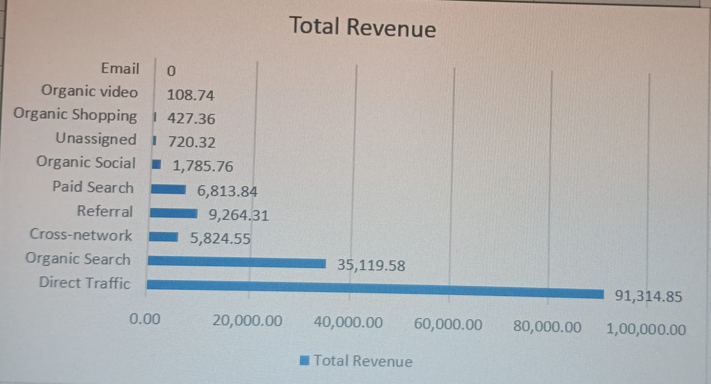
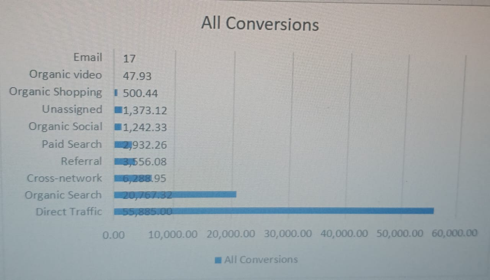

# GA4 Data Analysis Excel

## Dashboard Preview

### Total Revenue

### All Conversions

## Project Overview
This project analyzes Google Analytics 4 (GA4) data using Microsoft Excel.

## Objective
To analyze website performance by tracking Total Revenue and Conversions using an Excel dashboard.

## Dashboard Features
- GA4 Data Analysis
- Total Revenue Chart
- Conversion Chart
- Business Insights
- Interactive Excel Dashboard
  
## Key Insights

- Analyzed Google Analytics 4 (GA4) website performance data.
- Tracked Total Revenue to measure business performance.
- Monitored All Conversions to evaluate marketing effectiveness.
- Built an interactive Excel dashboard using charts and data visualization.
- Converted raw GA4 data into meaningful business insights.
  
## Tools Used
- Microsoft Excel
- Google Analytics 4 (GA4)

## Author
Varun Dalmia
